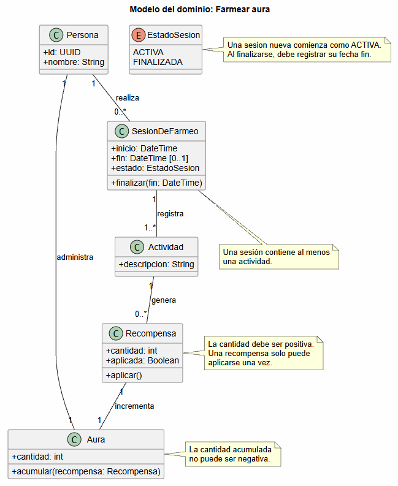

# Modelo del dominio: Farmear aura

## Diagrama de Aura

## Glosario

- **Persona:** quien realiza el farmeo.
- **Aura:** cantidad acumulada por la persona como resultado de sus recompensas.
- **SesionDeFarmeo:** periodo durante el cual la persona realiza actividades para conseguir aura.
- **EstadoSesion:** estado que indica si una sesión está activa o finalizada.
- **Actividad:** acción realizada durante el farmeo.
- **Recompensa:** beneficio obtenido al realizar una actividad, expresado como una cantidad de aura.

## Supuestos

- El aura se puede acumular y su cantidad no puede ser negativa.
- Cada persona administra una única cantidad acumulada de aura.
- Una persona puede realizar varias sesiones de farmeo.
- Una sesión contiene una o varias actividades.
- Una sesión nueva comienza en estado **ACTIVA** y puede no tener fecha de fin.
- Una sesión **FINALIZADA** debe tener fecha de fin posterior a su fecha de inicio.
- Una actividad puede no generar recompensas o generar varias.
- Cada recompensa incrementa la cantidad de aura de la persona.

## Decisiones de modelado

- **SesionDeFarmeo** representa que el farmeo no es una única acción, sino un conjunto de actividades realizadas durante un periodo.
- **EstadoSesion** se modela como un enumerado para hacer explícito el ciclo de vida de una sesión.
- La fecha de fin es opcional mientras la sesión está activa y se vuelve obligatoria al finalizarla.
- La composición entre **SesionDeFarmeo** y **Actividad** indica que las actividades pertenecen al registro de la sesión en la que se realizan.
- La relación de **Actividad** con **Recompensa** es de cero a muchas porque una actividad puede no producir nada o producir más de un beneficio.
- **Aura** tiene la responsabilidad de acumular la cantidad recibida mediante las recompensas.
